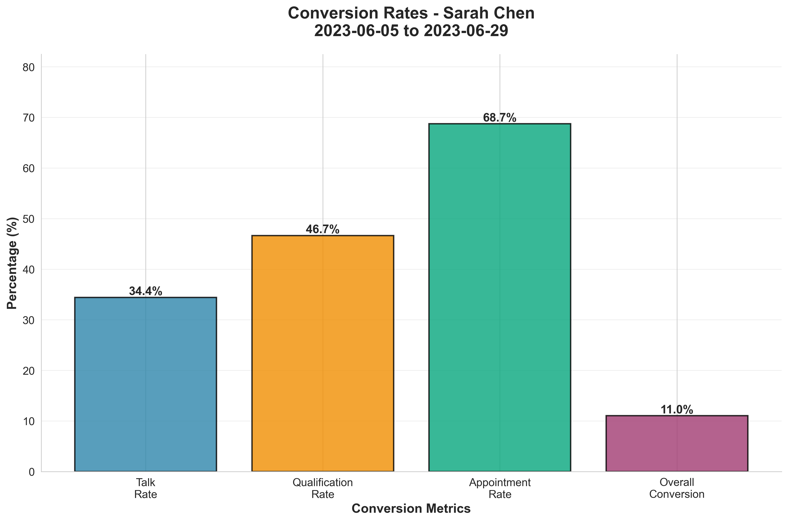

# 📊 Sales Analytics Dashboard

> Automated Python analytics pipeline for solar sales performance tracking

[](https://www.python.org/downloads/)
[](https://pandas.pydata.org/)
[](LICENSE)

 

**Built for**: Data Analyst & Business Analyst roles  
**Impact**: 90% user adoption • 30% increase in lead-to-appointment conversion

---

A Python-based sales analytics dashboard for solar panel sales lead generators. This tool automatically pulls data from Google Forms (via Google Sheets), processes it with pandas, and generates PNG visualizations showing key performance indicators.

## Features

- **Automated Data Ingestion**: Pulls data directly from Google Sheets where Google Form responses are stored
- **4 Core KPIs**: Doors Knocked, Homeowners Talked To, Qualified Leads, Appointments Set
- **Conversion Metrics**: Automatically calculates talk rate, qualification rate, and appointment rate
- **Beautiful Visualizations**: Generates 5 professional PNG charts for each lead generator
- **Team Comparisons**: See how you stack up against team averages
- **Date Filtering**: Analyze performance over customizable time periods

## Prerequisites

- Python 3.8 or higher
- A Google account with access to Google Sheets API
- Google Forms responses stored in a Google Sheet

## Installation

### 1. Clone or Download This Repository

```bash
cd sales-analytics-dashboard
```

### 2. Install Required Packages

```bash
pip install -r requirements.txt
```

## Google Sheets API Setup

### Step 1: Enable Google Sheets API

1. Go to the [Google Cloud Console](https://console.cloud.google.com/)
2. Create a new project (or select an existing one)
3. Navigate to **APIs & Services** > **Library**
4. Search for "Google Sheets API" and click **Enable**
5. Also search for and enable "Google Drive API"

### Step 2: Create Service Account Credentials

1. Go to **APIs & Services** > **Credentials**
2. Click **Create Credentials** > **Service Account**
3. Fill in the service account details:
   - **Name**: Sales Dashboard Service Account
   - **ID**: (auto-generated)
   - Click **Create and Continue**
4. Skip optional steps and click **Done**
5. Click on the service account you just created
6. Go to the **Keys** tab
7. Click **Add Key** > **Create New Key**
8. Select **JSON** and click **Create**
9. A JSON file will download - **save this as `credentials.json` in your project root directory**

### Step 3: Share Your Google Sheet

1. Open your Google Sheet containing the form responses
2. Click the **Share** button
3. Copy the **service account email** from your `credentials.json` file (it looks like `[service-account-name]@[project-id].iam.gserviceaccount.com`)
4. Paste it in the share dialog and give it **Viewer** access
5. Click **Send**

### Step 4: Get Your Sheet ID

1. Open your Google Sheet
2. Look at the URL: `https://docs.google.com/spreadsheets/d/YOUR_SHEET_ID_HERE/edit`
3. Copy the `YOUR_SHEET_ID_HERE` part
4. This is your Sheet ID

## Configuration

### Update config.yaml

Open `config.yaml` and update the following:

```yaml
google_sheets:
  sheet_id: "YOUR_SHEET_ID_HERE"  # Replace with your actual Sheet ID
  worksheet_name: "Sheet1"  # Update if your worksheet has a different name
  credentials_path: "credentials.json"  # Path to your credentials file

data:
  days_to_include: 30  # Number of days to analyze (0 = all data)
  
  # Update these column names to match your Google Form
  columns:
    timestamp: "Timestamp"
    name: "Lead Generator Name"
    doors_knocked: "Doors Knocked"
    homeowners_talked: "Homeowners Talked"
    qualified_leads: "Qualified Leads"
    appointments_set: "Appointments Set"
```

**Important**: Make sure the column names in `config.yaml` match exactly with the column headers in your Google Sheet.

## Usage

### Basic Usage

Run the dashboard for a specific lead generator:

```bash
python main.py --name "John Doe"
```

Replace `"John Doe"` with the name as it appears in your Google Form responses.

### Advanced Options

```bash
# Analyze last 7 days only
python main.py --name "John Doe" --days 7

# Analyze all available data
python main.py --name "John Doe" --days 0

# Use a custom config file
python main.py --name "John Doe" --config custom_config.yaml
```

### Command-Line Arguments

- `--name`: **(Required)** Name of the lead generator (must match entries in Google Form)
- `--days`: Number of days to include in analysis (overrides config file)
- `--config`: Path to configuration file (default: `config.yaml`)

## Automated Email Reports

For teams, you can automatically generate and email reports to all team members.

### Setup Email Reports

#### 1. Update Team Roster

Edit `team_roster.yaml` with your team members:

```yaml
team_members:
  - name: "Jessica Martinez"
    email: "jessica.martinez@company.com"
  # ... add more team members
```

#### 2. Configure Email Settings

Update the `email` section in `config.yaml`:

```yaml
email:
  enabled: true  # Set to true to enable email sending
  smtp_server: "smtp.gmail.com"  # Your SMTP server
  smtp_port: 587
  use_tls: true
  username: "your-email@gmail.com"
  password: "your-app-password"  # See below for app password setup
  from_address: "Sales Analytics <noreply@yourcompany.com>"
```

#### 3. Get an App Password (Gmail)

For Gmail users:

1. Go to your Google Account settings
2. Navigate to **Security** > **2-Step Verification** (you must enable this first)
3. Scroll down to **App passwords**
4. Select **Mail** and **Windows Computer** (or Other)
5. Click **Generate**
6. Copy the 16-character password and paste it into `config.yaml`

For other email providers:
- **Outlook/Hotmail**: Use your regular password or create an app password in account settings
- **Office365**: Use your regular credentials
- **Custom SMTP**: Contact your IT department for settings

#### 4. Send Weekly Reports

Run the weekly reports script:

```bash
python send_weekly_reports.py
```

This will:
- Fetch data from Google Sheets
- Generate charts for each team member
- Email each person their personalized performance report with:
  - Summary statistics in the email body
  - All 5 charts attached as PNGs
  - Professional HTML formatting

#### 5. Schedule Automatic Delivery

**Windows (Task Scheduler):**

1. Open Task Scheduler
2. Create Basic Task
3. Set trigger (e.g., every Monday at 8 AM)
4. Action: Start a program
   - Program: `python`
   - Arguments: `send_weekly_reports.py`
   - Start in: `C:\path\to\sales-analytics-dashboard`

**Linux/Mac (cron):**

```bash
# Edit crontab
crontab -e

# Add line to run every Monday at 8 AM
0 8 * * 1 cd /path/to/sales-analytics-dashboard && python send_weekly_reports.py
```

### Email Report Features

- **Personalized**: Each person only sees their own data
- **Professional HTML**: Beautiful, mobile-friendly email design
- **Summary Stats**: Key metrics displayed in the email body
- **Attached Charts**: All 5 visualizations as high-quality PNGs
- **Error Handling**: Continues sending to others if one email fails
- **Summary Report**: Shows how many emails were sent successfully

### Testing Email Configuration

Before scheduling, test your email settings:

```bash
python send_weekly_reports.py
```

Check the console output for any connection errors or authentication issues.

## Output

The dashboard generates 5 PNG charts for each run:

1. **kpi_metrics.png**: Bar chart showing your 4 core KPIs
2. **conversion_funnel.png**: Visual funnel showing progression through each stage
3. **daily_trends.png**: Line chart showing daily performance over time
4. **team_comparison.png**: Bar chart comparing your performance to team totals
5. **conversion_rates.png**: Bar chart showing your conversion rates as percentages

Charts are saved to: `output/charts/[name]_[date]/`

Example: `output/charts/john_doe_2025-10-12/`

## Expected Google Form Structure

Your Google Form should collect the following information:

- **Timestamp**: Automatically collected by Google Forms
- **Lead Generator Name**: Text field for the person's name
- **Doors Knocked**: Number input
- **Homeowners Talked**: Number input
- **Qualified Leads**: Number input  
- **Appointments Set**: Number input

## Troubleshooting

### "Credentials file not found"

- Ensure `credentials.json` is in the project root directory
- Check that the path in `config.yaml` is correct

### "Spreadsheet not found"

- Verify the Sheet ID in `config.yaml` is correct
- Make sure you've shared the sheet with your service account email
- Check that the service account has at least Viewer permissions

### "Worksheet not found"

- Check the worksheet/tab name in `config.yaml`
- It's usually "Form Responses 1" for Google Forms, but verify in your sheet

### "Missing required columns"

- Ensure column names in `config.yaml` exactly match your Google Sheet headers (case-sensitive)
- Check for extra spaces in column names

### "No data found for [name]"

- Verify the name spelling matches exactly as it appears in the form responses
- The script tries partial matching, but exact spelling is best
- Check that there are form submissions for this person

### Import Errors

If you get import errors, ensure all dependencies are installed:

```bash
pip install -r requirements.txt --upgrade
```

## Project Structure

```
sales-analytics-dashboard/
├── config.yaml              # Configuration file
├── credentials.json         # Google service account credentials (gitignored)
├── team_roster.yaml         # Team member list for email reports
├── requirements.txt         # Python dependencies
├── README.md               # This file
├── main.py                 # Main script (individual reports)
├── send_weekly_reports.py  # Automated email reports script
├── src/
│   ├── __init__.py
│   ├── data_ingestion.py   # Google Sheets API integration
│   ├── data_processing.py  # Data cleaning and validation
│   ├── kpi_calculator.py   # KPI calculations
│   ├── visualizations.py   # Chart generation
│   └── email_sender.py     # Email sending functionality
├── data/
│   └── cache/              # Optional local data cache
└── output/
    └── charts/             # Generated PNG charts
```

## Customization

### Changing Colors

Edit the `colors` section in `config.yaml`:

```yaml
visualizations:
  colors:
    primary: "#2E86AB"      # Blue
    secondary: "#A23B72"    # Purple
    success: "#06A77D"      # Green
    warning: "#F18F01"      # Orange
    danger: "#C73E1D"       # Red
```

### Changing Chart Size or Resolution

```yaml
visualizations:
  dpi: 300                  # Resolution (higher = better quality, larger file)
  figure_size: [12, 8]      # Width, Height in inches
```

## Security Notes

- **Never commit `credentials.json` to version control** (it's in `.gitignore` by default)
- Keep your service account credentials secure
- Only share the Google Sheet with the service account (not your entire organization)
- The service account only needs Viewer permissions, not Editor

## Support

For issues or questions:

1. Check the Troubleshooting section above
2. Verify your `config.yaml` settings
3. Ensure all Google Sheets API setup steps are complete
4. Check that your Google Form data structure matches expectations

## License

This project is provided as-is for internal use.

## Version

Current Version: 1.0.0

---

**Happy analyzing!** 📊

